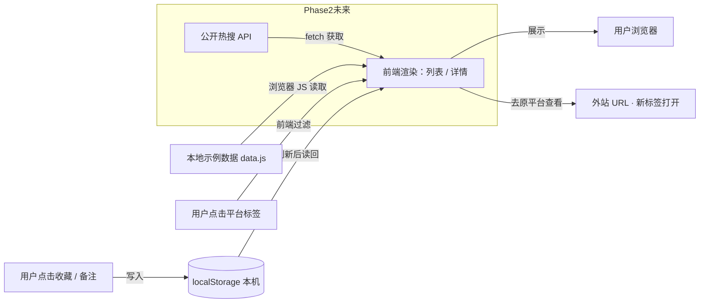

# 技术设计：今日热搜网站（TECH_DESIGN.md）

> 训练营 Day 5 产出，基于 Day 3 `research.md` 与 Day 4 `PRD.md`。
> 本文只定义**用什么技术、为什么、数据怎么流**，不写任何代码。
> 项目定位：零基础 28 天能扛住的**纯静态**热搜聚合站。

---

## 一、技术路线（一句话）

> **纯静态站点 = HTML5 + CSS3 + 原生 JavaScript（ES6）+ 浏览器 localStorage（收藏/备注）+ GitHub Pages（免费托管）。无后端、无数据库、不引入前端框架。**

这一行就是 Day 5 要交的"技术路线那一行"。下面逐层展开。

---

## 二、技术栈总览

| 层级 | 选型 | 用途 | 零基础友好 |
|---|---|---|---|
| 页面结构 | **HTML5** | 搭首页 / 详情 / 收藏区的骨架 | ✅ |
| 页面样式 | **CSS3**（Flex/Grid） | 排版、高亮当前平台标签、响应式 | ✅ |
| 页面逻辑 | **原生 JavaScript（ES6）** | 平台切换、渲染列表、收藏/备注、跳转外站 | ✅ |
| 示例数据 | **本地 JS/JSON 文件**（如 `data.js`） | Phase 1 手写几条示例热搜先把页面撑起来 | ✅ |
| 用户数据 | **浏览器 localStorage** | 收藏 / 备注只存本机，不依赖账号 | ✅ |
| 部署 | **GitHub Pages** | 接 Day 2 仓库，免费零运维上线 | ✅ |
| 开发协作 | **WorkBuddy（vibe coding）+ Git + 浏览器** | 让 AI 生成/改代码，自己用浏览器验收 | ✅ |

---

## 三、各选型理由

- **原生 JS，而不是 React / Vue**：零基础阶段不需要"构建工具"（npm、打包、虚拟 DOM）。React 要装 Node 依赖、要打包，超出 28 天 MVP 范围；原生 JS 写好的文件双击就能在浏览器打开，最省事。
- **本地示例数据，而不是真实 API**：Phase 1 的目标是"先把页面做出来"。示例数据不依赖网络、不需要密钥、不会报错，先把交互跑通；Phase 2（D15 后）再接公开热搜 API（见 `research.md` §6.3）。
- **localStorage，而不是后端数据库**：收藏/备注只需要"本机记住"，用 `localStorage` 几十行就能实现，完全不需要账号系统（呼应 PRD 第八节砍功能）。
- **GitHub Pages，而不是买服务器**：免费、接 Day 2 已建好的仓库、提交即上线，满足 PRD 验收标准 AC7「无后端、无数据库、部署后任意设备可访问」。

---

## 四、部署方案

- GitHub Pages 直接从本仓库 `main` 分支的静态文件提供服务（根目录或 `/docs`）。
- 工作流：本地写 `index.html` 等 → `git push` → GitHub Pages 自动上线，通常 1 分钟内生效。
- 不需要服务器、不需要域名（默认 `https://<用户名>.github.io/vibe-coding-journey/`）。

---

## 五、数据流（含图）

### 数据流图（Mermaid，GitHub 网页打开会自动渲染成图）

### 一句话说清数据从哪来、到哪去（Day 5 要掌握）

> **数据来自本地示例文件（未来接公开热搜 API），由浏览器前端读取并展示；你的收藏 / 备注只存在本机浏览器 localStorage，「去原平台查看」则跳转到外部链接——全程没有后端、没有数据库。**

拆解：
- **从哪来**：Phase 1 = 仓库里的本地示例文件；Phase 2 = 各平台公开热搜 API。
- **到哪去**：① 渲染进用户浏览器页面；② 用户收藏/备注写进本机 localStorage（仅本机可见）；③ 用户点"去原平台"跳到外部链接（数据出口）。
- **不经过**：任何服务器、任何数据库、任何账号系统。

---

## 六、降级方案 / 卡住处理（呼应 PRD §七异常状态）

| 卡住场景 | 处理方式 |
|---|---|
| 示例数据缺失 / 格式错 | 页面提示"示例数据异常"，按 PRD §七给明确报错，便于排查 |
| 浏览器禁用 localStorage（隐私模式） | 收藏/备注提示"当前无法保存"，不报错崩溃 |
| 某平台接口临时不可用（Phase 2） | 该平台列表显示"数据暂不可用"，其余平台正常 |
| 完全不会写 JavaScript | 先用 WorkBuddy 生成骨架，再逐步改文字和内容，不要求手写 |

---

## 七、方案变化时哪些文件会受影响（余力加练 4.1）

| 变更场景 | 受影响文件 | 说明 |
|---|---|---|
| 调整热搜字段（如加"分类"） | `data.js` + 渲染 JS + `PRD.md` §六 | 数据结构和展示同步改 |
| 新增一个平台 | `data.js` + 平台切换 JS + `index.html` | 标签和数据集都要加 |
| 加"收藏导出/导入" | 收藏 JS + localStorage 逻辑 | 仅本机功能扩展 |
| 接真实 API（Phase 2） | 新增 `fetch` 模块 + 替换 `data.js` 数据来源 | 密钥走 `.env`（Day 23 才用），**不进仓库** |
| 改视觉样式 | `style.css` | 不影响逻辑 |
| 改部署方式 | 无代码改动，仅 GitHub 设置 | — |

---

## 附录：技术栈科普（余力加练 4.2）

做网页/App 会碰到这几类技术，各自作用与优劣势：

- **前端（HTML / CSS / JavaScript）**：你眼睛能看到的部分。HTML 是骨架，CSS 是化妆，JS 让页面动起来。优势：直接浏览器运行、零部署成本；劣势：复杂交互写多了会乱，需要组织。
- **后端（Node.js / Python / Java 等）**：你看不到但一直在干活的"服务员"，负责算逻辑、管业务。优势：能做账号、能存数据、能接第三方；劣势：要服务器、要运维、零基础门槛高。**本项目刻意不用它。**
- **数据库（MySQL / PostgreSQL / MongoDB 等）**：系统的"仓库货架"，存所有要记住的东西。优势：数据持久、可查询；劣势：要部署、要设计表结构。**本项目用 localStorage 代替，足够。**
- **框架（React / Vue / Next.js 等）**：前人写好的一整套"脚手架"，让你少写重复代码。优势：工程化强、适合大项目；劣势：要学构建工具、有额外复杂度。**本项目零基础阶段不引入。**
- **静态托管（GitHub Pages / Vercel）**：把纯前端文件直接放到网上给人访问。优势：免费、零运维；劣势：不能跑后端逻辑（正好本项目不需要）。

**一句话**：本项目只用了"前端 + 静态托管 + 本机存储"这最轻的一组，把后端、数据库、框架全部砍掉——这就是 28 天能做完的根本原因。

---

## 附：与 PRD / research 的关系

- 技术选型（纯静态、localStorage、GitHub Pages）继承自 `research.md` 第四节与 `PRD.md` 第一节，本文落实细节。
- 数据流严格遵循 PRD §六「数据来源策略」：Phase 1 本地示例，Phase 2 公开 API，绝不自建爬虫。
