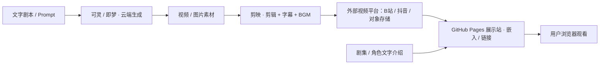

# 技术设计：AI漫剧《我在大学期间用AI买股身价过亿》（ai-drama-tech-design.md）

> 研究日期：2026-09-20；技术设计：Day 5 补充。
> 基于 `ai-drama-research.md`（Day 3 需求研究）。
> 本文只定义**用什么技术、为什么、数据怎么流**，不写任何代码。
> 项目定位：零基础 30 天，用现成 AI 工具生成短漫剧 + 一个纯静态展示站。

---

## 一、技术路线（一句话）

> **内容用可灵 / 即梦生成 + 剪映剪辑；展示站是纯静态网页（HTML/CSS/JS）+ GitHub Pages；视频本体托管在外部平台（B站 / 抖音 / 对象存储）后以链接或嵌入方式引用。无后端、无数据库、不碰原生 App。**

这一行就是本项目的"技术路线那一行"。下面逐层展开。

---

## 二、技术栈总览

| 层级 | 选型 | 用途 | 零基础友好 |
|---|---|---|---|
| 内容生成 | **可灵 AI / 即梦 AI**（云端 SaaS） | 文/图生视频、口型驱动、人物一致性 | ✅（免费档起步） |
| 剪辑合成 | **剪映**（或即梦一键成片） | 拼镜头、加字幕 / BGM / 转场 | ✅（与即梦打通） |
| 配音 | **即梦 / 剪映 内置 AI 配音 + 免费 BGM** | 让角色开口说话、配乐 | ✅ |
| 展示站 | **HTML / CSS / 原生 JS 静态站** | 首页 / 分集页 / 角色页 / 花絮页 | ✅ |
| 视频托管 | **外部平台（B站 / 抖音 / 对象存储）** | 存视频本体（GitHub 不适合放大文件） | ✅ |
| 部署 | **GitHub Pages** | 接 Day 2 仓库，免费零运维 | ✅ |
| 开发协作 | **WorkBuddy（vibe coding）+ Git** | 生成/改站点代码 | ✅ |

---

## 三、各选型理由

- **不造引擎，只做组装**：人物一致性、文生视频这些"重活"直接用可灵/即梦现成工具，自己不训练模型、不写生成算法——这正是 research 第四节"认知改变"的结论。
- **剪映而非专业剪辑软件**：即梦生成物可一键进剪映，新手零学习成本；字幕、BGM、转场一站搞定。
- **GitHub Pages 展示站**：接 Day 2 已建好的仓库，免费、提交即上线；符合 research 第五节"用 GitHub Pages 搭展示网站"。
- **视频外链而非放 GitHub**：GitHub 单文件建议 <100MB、仓库 <1GB；长视频直接放会超限且加载慢，所以视频传到外部平台后再嵌入网站（research 第八节"不确定信息 7"已标注待定）。

---

## 四、部署方案

- **展示站**：GitHub Pages 从本仓库 `main` 分支提供静态文件，与今日热搜站点共用同一个仓库（分目录或分文件），提交即上线。
- **视频本体**：不上 GitHub，传到 B站 / 抖音 / 对象存储，网站里用 `<iframe>` 或链接引用。
- **不碰**：iOS / 安卓原生开发、后端服务、用户系统。

---

## 五、数据流（含图）

### 数据流图（Mermaid，GitHub 网页打开会自动渲染成图）

### 一句话说清数据从哪来、到哪去（Day 5 要掌握）

> **漫剧素材由云端 AI 工具（可灵/即梦）生成、剪映剪辑成片后上传到外部视频平台；展示站本身是纯静态网页，只存文字介绍和视频链接，不存视频本体。**

拆解：
- **从哪来**：① 内容素材 = 可灵/即梦云端生成（输入是文字剧本/Prompt）；② 站点文字 = 手写静态内容（HTML）。
- **到哪去**：成片 → 外部视频平台 → 被展示站引用 → 用户浏览器观看；文字介绍 → 直接进展示站。
- **不经过**：任何后端、任何数据库、任何账号系统（纯静态）。

---

## 六、降级方案 / 风险处理（呼应 research 第八节）

| 卡住场景 | 处理方式 |
|---|---|
| 免费额度收紧 | 先多抽次、凑免费；不够再考虑即梦 ¥32/月 会员 |
| 角色跨集一致性翻车 | 第 1–2 周实测，用"图生视频 + 首尾帧 + 参考图"约束 |
| 内容合规风险（金融题材） | 发布前加"剧情虚构、不构成投资建议"声明，确认平台不触线 |
| GitHub 放不下视频 | 视频一律外链，仓库只放文字与缩略图 |
| 完全不会剪映 | 用即梦"一键成片"先出粗剪，再逐步学精修 |

---

## 七、方案变化时哪些文件会受影响（余力加练 4.1）

| 变更场景 | 受影响文件 | 说明 |
|---|---|---|
| 加一集漫剧 | 分集页 HTML + 对应视频链接 | 站点内容扩展 |
| 换生成工具（可灵↔即梦） | 工作流文档 / 复盘笔记 | **不影响站点代码**，只影响生产方式 |
| 加一个角色 | 角色页 HTML | 静态内容 |
| 改视频托管平台 | 展示站里的 `<iframe>` / 链接地址 | 仅替换引用 |
| 接评论区（未来） | 需引入第三方嵌入（如 Disqus）| 本期不做（静态站不接动态） |
| 改部署方式 | 无代码改动，仅 GitHub 设置 | — |

---

## 附：与 research 的关系

- 技术选型全部来自 `ai-drama-research.md` 第五节（30 天 MVP 技术选型）与第六节（本期不做）。
- 数据流严格遵循"先用现成工具生成内容，再用网站展示，商业化放到以后"的 MVP 战略。
- 两个项目（今日热搜 / AI漫剧）共用同一个 GitHub 仓库 `vibe-coding-journey`，但文件相互独立、互不影响。
