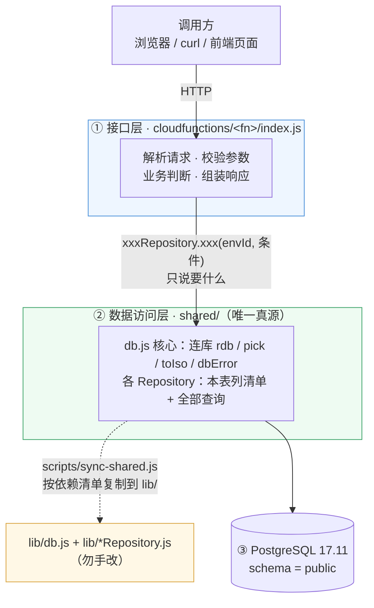

# 云函数部署与验证手册（Day 17 起 · Day 18 增补写入接口 · Day 19 分层重构）

本仓库有**两条独立的业务线**，表与接口各自隔离，共用同一个 CloudBase 环境：

| 线 | 目录 | 契约 | 接口 |
|---|---|---|---|
| 今日热搜 | `my-app/` | 根目录 `api-contract.md` | `/api/hot`、`/api/favorites`、`/api/sync` |
| AI 漫剧 | `ai-drama/` | `ai-drama/api-contract.md` | `/api/drama/episodes`、`/api/drama/watch-logs` |

本文第 1–5 节是**今日热搜线**，第 6 节是 **AI 漫剧线**，第 7 节是 **Day 18 的写入接口（POST /api/favorites）**。
另有 `health`（GET /api/health，两条线共用）作为健康检查探针。

> 命令里的环境 ID **不写死**，一律从本地 `cloudbaserc.json` 读取：
> `ENV=$(node -p "require('./cloudbaserc.json').envId")`
> 该文件已 gitignore，环境 ID 不进仓库、不进聊天。

---

## 0. 一次性准备

```bash
# tcb CLI 不在 PATH 里，先加上（Git Bash / MINGW64）
export PATH="$PATH:/c/Users/86153/.workbuddy/binaries/node/workspace/node_modules/.bin"

cd /c/Users/86153/WorkBuddy/vibe-coding-journey
ENV=$(node -p "require('./cloudbaserc.json').envId")
```

---

## 1. 部署步骤

### 1.1 部署云函数

```bash
tcb fn deploy hot -e "$ENV" --force
```

```bash
tcb fn deploy sync -e "$ENV" --force
```

> ⚠️ **`--force` 必须带**：函数已存在时 CLI 会弹
> `Cloud function with same name exists ... overwrite? (y/N)` 交互确认，
> 在脚本/AI 执行环境下没人应答 → 命令卡住不结束（不是部署失败，是等输入）。

依赖由平台侧安装（`cloudbaserc.json` 里 `installDependency: true`），
**本地不需要 `node_modules`**。

### 1.2 配置 HTTP 访问路径（只需一次）

首次部署后在控制台「HTTP 访问服务」里加路由，或用 CLI：

```bash
tcb service create -e "$ENV" --path /api/hot --name hot
```

```bash
tcb service create -e "$ENV" --path /api/sync --name sync
```

查看已有路由：

```bash
tcb service list -e "$ENV"
```

### 1.3 部署前端静态站

```bash
tcb hosting deploy my-app -e "$ENV"
```

接口地址（复制到浏览器打开即可看 JSON 返回）：

```bash
node -p "'https://'+require('./cloudbaserc.json').envId+'.service.tcloudbase.com/api/hot'"
```

页面地址：

```bash
node -p "'https://'+require('./cloudbaserc.json').envId+'-1500247035.tcloudbaseapp.com/'"
```

---

## 2. 浏览器验证方法

### 2.1 接口本身

浏览器打开 `/api/hot` 的地址，应看到：

```json
{"ok":true,"data":[{"id":"douyin-1","rank":1,"title":"2026诺贝尔物理学奖公布",
"heat":"1203 万","heatNum":12030000,"platform":"douyin","url":"...",
"date":"2026-10-06","createdAt":"..."}, ...],"count":20,"source":"synced","date":"2026-10-06"}
```

要确认的三件事：

| 看什么 | 期望 |
|---|---|
| `ok` | `true` |
| `count` | 20（默认前 20 条） |
| `data[].heatNum` | **从大到小**（7810000 → 7710000 → …），这是热度倒序的证据 |

加参数试：

```
?limit=5        只返回 5 条
?platform=weibo 只要微博
?date=2026-10-06 指定日期
```

传坏参数 `?date=2026-13-45` 应返回 **HTTP 400** 且 `error` 是可读中文：

```json
{"ok":false,"error":"date 参数格式不对，应该写成 YYYY-MM-DD，例如 2026-10-06"}
```

### 2.2 页面

打开静态站地址 → 首次会弹 CloudBase 测试域名提示页，点「确定访问」→ 页面应显示：

- 顶部绿色标注：**「真实数据 · 来源：抖音 · 2026-10-06 · 按热度倒序前 20 条」**
- 列表 20 条，第 1 条热度最高

> 若标注变成琥珀色「示例数据」，说明接口没连通（本地预览 / 接口 5xx），页面自动退回本地兜底数据。

---

## 3. 验证「读的是真数据库」

**方法：改一条数据库记录 → 重新请求 → 返回值必须跟着变。**

① 记下当前第一名：

```bash
curl -s "https://$ENV.service.tcloudbase.com/api/hot?limit=1"
```

② 改库里一条记录的热度（把 B站第 30 名改成 9999 万）：

```bash
tcb db execute -e "$ENV" --sql 'UPDATE "trends" SET "heat" = '"'"'9999 万'"'"' WHERE "id" = '"'"'bilibili-30'"'"' AND "date" = '"'"'2026-10-06'"'"';' < /dev/null
```

③ 重新请求，这条必须变成第 1 名：

```bash
curl -s "https://$ENV.service.tcloudbase.com/api/hot?limit=3"
```

预期：`9999 万 | bilibili-30` 排到第 1（改之前它在 30 名开外）。
**这一步同时证明两件事：数据来自真库（不是写死的假数据），且热度倒序真的生效。**

④ 还原（重新同步该平台）：

```bash
curl -s -X POST "https://$ENV.service.tcloudbase.com/api/sync" -H "Content-Type: application/json" -d '{"source":"bilibili","force":1}'
```

> 数据库操作也可以直接在控制台做：CloudBase 控制台 → 数据库 → trends 表 → 编辑某一行的 `heat`。

---

## 4. 同步云函数 POST /api/sync

### 4.1 三个平台的来源、必需请求头、字段映射（附录 F）

| 平台 | 接口 | 取数路径 | 标题 | 热度 | 名次 | 必需请求头 |
|---|---|---|---|---|---|---|
| 微博 `weibo` | `https://weibo.com/ajax/side/hotSearch` | `data.realtime[]` | `word` | `num` | `realpos` | 桌面 UA + `Referer: https://weibo.com/` |
| B站 `bilibili` | `https://api.bilibili.com/x/web-interface/search/square?limit=50` | `data.trending.list[]` | `keyword` | `heat_score` | 下标+1 | 桌面 UA + `Referer: https://www.bilibili.com/` |
| 抖音 `douyin` | `https://www.douyin.com/aweme/v1/web/hot/search/list/?device_platform=webapp&aid=6383` | `data.word_list[]` | `word` | `hot_value` | `position` | 桌面 UA + `Referer: https://www.douyin.com/` |

**请求头缺一不可（附录 F 实测）**：

- 微博缺 `Referer` → **403**
- B站缺桌面 UA → **412**（B站经典风控码）
- 抖音缺 `Referer` → **HTTP 200 但列表为空**（最坑：不报错，静默返回 0 条）

只用 Node 18 内置 `fetch`，**不引第三方依赖**。

### 4.2 判重规则

判重键 = **`(platform, title, date)`**：同一平台、同一天、同一标题只保留一条，
已存在则更新热度与名次，不存在才插入。

当前 `trends` 表只有主键 `id`（= `platform-rank`），没有 `(platform,title,date)` 唯一索引，
因此实现为**等价的应用层 upsert**：先按 `(platform, date)` 查出已有行并按 title 索引 →
命中则 update、未命中则 insert；插入若撞上主键则跳过并计数，不中断整批。

**可选增强（需授权改表）**——换成数据库层约束即可，语义完全等价：

```sql
ALTER TABLE "trends" ADD COLUMN IF NOT EXISTS "fetched_at" TIMESTAMPTZ DEFAULT now();
CREATE UNIQUE INDEX IF NOT EXISTS uq_trends_platform_title_date
  ON "trends" ("platform", "title", "date");
-- 之后写入改为 INSERT ... ON CONFLICT ("platform","title","date") DO UPDATE ...
```

### 4.3 合规约束（不绕过任何反爬 / 登录 / 频率限制）

- 只用**无需登录**的公开榜单接口，不抓 HTML、不解析签名参数、不模拟登录态；
- 不带 Cookie / Authorization，UA 只是常规桌面浏览器标识；
- 单源单次请求、8 秒超时，**失败不重试**，避免对上游形成高频冲击；
- 自带 **60 秒同步节流**：同一平台 60 秒内重复触发直接跳过，`force=1` 才能强制；
- 全部失败 → 返回中文说明，且**不动库里已有数据**。

### 4.4 手动触发方法

```bash
curl -s -X POST "https://$ENV.service.tcloudbase.com/api/sync" \
  -H "Content-Type: application/json" \
  -d '{"source":"weibo"}'
```

`source` 取值 `weibo` / `bilibili` / `douyin`（缺省 `weibo`）；可选 `date`、`force`。

三个平台各同步一次：

```bash
for s in weibo bilibili douyin; do
  curl -s -X POST "https://$ENV.service.tcloudbase.com/api/sync" \
    -H "Content-Type: application/json" -d "{\"source\":\"$s\"}"
  echo
done
```

### 4.5 验证步骤

① 首次同步 → `inserted` 接近 `fetched`：

```json
{"ok":true,"data":{"date":"2026-10-06","detail":[{"source":"weibo","name":"微博",
"status":"ok","fetched":51,"inserted":48,"updated":0,"skipped":3}],"changed":48},"count":48}
```

② 60 秒内再触发 → 被节流：

```json
{"ok":true,"data":{"detail":[{"source":"weibo","status":"skipped",
"reason":"距上次同步不足 60 秒，已跳过（如需强制请传 force=1）"}],"changed":0},"count":0}
```

③ `force=1` 再同步 → **`inserted` 应为 0、`updated` 变大**（判重命中，没有重复插入）：

```json
{"ok":true,"data":{"detail":[{"source":"weibo","name":"微博","status":"ok",
"fetched":50,"inserted":0,"updated":45,"skipped":5}],"changed":45},"count":45}
```

④ 数据库核对条数：

```bash
tcb db execute -e "$ENV" --sql 'SELECT "platform",count(*) FROM "trends" WHERE "date"='"'"'2026-10-06'"'"' GROUP BY "platform";' < /dev/null
```

⑤ 前端核对：`/api/hot` 的 `count` 与来源标注随同步结果变化。

---

## 5. 常见坑

| 症状 | 原因与处理 |
|---|---|
| 部署命令卡住不动 | 缺 `--force`，在等覆盖确认 |
| 接口 500 `Invalid schema` | `app.rdb()` 必须传 `{ database: "public" }`，该参数是 **schema 名**不是库名 |
| `tcb fn log` 报 topic not exist | CLS 日志未开通，**改用 `tcb fn invoke <name>` 直接调用排查** |
| 页面显示「示例数据」 | 接口没连通（本地预览 / 5xx），前端自动退回本地兜底 |
| 抖音返回 200 但 0 条 | 缺 `Referer` 头 |
| B站 412 | 缺桌面 UA |
| 同步有 `skipped` | 跨天存在相同 `platform-rank` 撞主键（表主键没带 date），已按条跳过不影响整体；根治见 §4.2 改表 |
| 静态站首次访问弹提示页 | 测试域名提示，点「确定访问」即可（不写 cookie，重新导航会再弹） |

---

# 6. AI 漫剧线（ai-drama）

> 完整契约见 `ai-drama/api-contract.md`。数据来源判定：
> **我自己产出的内容**（不是外部公开数据）+ **要能回看过去** + **不存就没了**
> → 结论是「用户产出 → 必须入库」，所以**不接任何外部 API**，接口读的是自己的表。

## 6.1 表

| 表 | 角色 | 对应打卡应用 | 说明 |
|---|---|---|---|
| `drama_episodes` | **核心表** | `plan_days` | 剧集内容本体（6 集，来自 `assets/js/data.js`） |
| `drama_watch_logs` | **记录表** | `checkins` | 观看记录，一次观看 = 一次打卡 |

建表 / 种子（幂等，可重复执行）：

```bash
SQL=$(cat db/drama_schema.sql); tcb db execute -e "$ENV" --sql "$SQL" < /dev/null
```

```bash
SQL=$(cat db/drama_seed.sql); tcb db execute -e "$ENV" --sql "$SQL" < /dev/null
```

> ⚠️ `"order"` 是 **SQL 保留字**，所有 SQL 里必须写成带引号的 `"order"`；
> 其余驼峰列（`episodeId` / `watchedAt`）同理要加引号，否则会被折叠成小写。

## 6.2 部署步骤

```bash
tcb fn deploy drama-episodes -e "$ENV" --force
```

```bash
tcb fn deploy drama-watchlogs -e "$ENV" --force
```

配置 HTTP 路由（**必须加 `MSYS_NO_PATHCONV=1`**）：

```bash
MSYS_NO_PATHCONV=1 tcb service create -e "$ENV" -p /api/drama/episodes -f drama-episodes
```

```bash
MSYS_NO_PATHCONV=1 tcb service create -e "$ENV" -p /api/drama/watch-logs -f drama-watchlogs
```

> ⚠️ **Git Bash 会把 `/api/...` 转成 Windows 绝对路径**，不加 `MSYS_NO_PATHCONV=1` 会创建出
> `/C:/Users/.../api/drama/episodes` 这种废路由（看着"创建成功"，实际访问 404）。
> 中招后用 `tcb service delete -e "$ENV" -n drama-episodes` 按函数名删掉重来。

## 6.3 浏览器验证方法

接口地址：

```bash
node -p "'https://'+require('./cloudbaserc.json').envId+'.service.tcloudbase.com/api/drama/episodes'"
```

```bash
node -p "'https://'+require('./cloudbaserc.json').envId+'.service.tcloudbase.com/api/drama/watch-logs'"
```

期望（`GET /api/drama/episodes`）：

```json
{"ok":true,"data":[{"id":"ep01","order":1,"title":"群里的光","status":"剧本定稿",
"duration":"约 90 秒","durationSec":90,"summary":"…","scene":"…","videoUrl":"",
"cast":["linmo","aqiang"],"updatedAt":"…"}],"count":6,"error":null}
```

要确认的三件事：

| 看什么 | 期望 |
|---|---|
| `count` | 6（6 集全在） |
| `data[].order` | 1→6 **升序** |
| `data[].cast` | 是**数组** `["linmo","aqiang"]`（不是字符串） |

`GET /api/drama/watch-logs` 期望：`count` 6，且 `watchedAt` **倒序**（最近的排最前）。

参数与错误：

```
/api/drama/episodes?limit=3          前 3 集
/api/drama/episodes?status=已发布     按状态筛（无匹配时 count=0，不是错误）
/api/drama/watch-logs?episodeId=ep01 只看某一集的观看记录
/api/drama/episodes?limit=abc        → HTTP 400 + {"ok":false,"data":null,"error":"limit 必须是正整数，例如 limit=3"}
```

## 6.4 验证「改一条数据库数据、接口跟着变」

① 记下改前状态：

```bash
curl -s "https://$ENV.service.tcloudbase.com/api/drama/episodes?limit=1"
```

② 改库（把第 1 集改成「已发布」并填外链）：

```bash
tcb db execute -e "$ENV" --sql 'UPDATE "drama_episodes" SET "status" = '"'"'已发布'"'"', "videoUrl" = '"'"'https://b23.tv/demo-ep01'"'"' WHERE "id" = '"'"'ep01'"'"';' < /dev/null
```

③ 重新请求 → `status` 必须变成「已发布」、`videoUrl` 必须出现：

```bash
curl -s "https://$ENV.service.tcloudbase.com/api/drama/episodes?limit=1"
```

④ 顺带验证筛选也跟着变（`?status=已发布` 应能筛出这一集）：

```bash
curl -s "https://$ENV.service.tcloudbase.com/api/drama/episodes?status=%E5%B7%B2%E5%8F%91%E5%B8%83"
```

⑤ 还原：

```bash
tcb db execute -e "$ENV" --sql 'UPDATE "drama_episodes" SET "status" = '"'"'剧本定稿'"'"', "videoUrl" = '"'"''"'"' WHERE "id" = '"'"'ep01'"'"';' < /dev/null
```

> 也可以在 CloudBase 控制台 → 数据库 → `drama_episodes` 表里直接改一行，效果相同。

---

## 7. Day 18 ｜`POST /api/favorites`（新增收藏 · 写入接口）

> 实现在 `cloudfunctions/favorites/index.js`，跟 `GET /api/favorites` **共用一个云函数**（按 `method` 分发），路由 **不需要** 新建 —— `/api/favorites` 这条路由 Day 17 已建，POST 自动走它。
> 契约见根目录 `api-contract.md` §3.7。

### 7.1 这个接口防了哪两种「重复提交 / 错误输入」（今日核心题）

| 类型 | 防法 | 表现 |
|---|---|---|
| **业务重复**：同一条热搜收藏两次 | 判重键 = `favorites."trendId"`，先查后插 | `409` + 「已经收藏过了」，库里不会有两行指向同一条热搜 |
| **手抖连点 / 网络超时重试** | 请求头 `Idempotency-Key`（或请求体 `clientRequestId`）被编进主键 `id = fav-idem-<key>` | 同一个 key 再发 → `200` + 返回**同一条**数据，**不多一行** |

顺带挡住的错误输入：空 body / 非 JSON / 缺必填字段（一次列全）/ 字段类型不对 / 超长（title、note ≤ 200，trendId ≤ 100）/ `platform` 不在白名单 / `trendId` 在 `trends` 表里不存在（先查再插 → `404` 中文提示，不让外键约束抛成看不懂的 500）。

### 7.2 部署

```bash
tcb fn deploy favorites -e "$ENV" --force
```

> 路由已存在（Day 17 建的 `/api/favorites`），**不用** 再 `tcb service create`。
> 不确定就 `tcb service list` 看一眼。

### 7.3 命令行验证六连（curl，每条都能直接粘贴）

```bash
curl -s -m 40 -w "\n[HTTP %{http_code}]\n" -X POST "https://$ENV.service.tcloudbase.com/api/favorites" -H "Content-Type: application/json" -H "Idempotency-Key: my-test-001" -d '{"trendId":"weibo-2","title":"诺贝尔物理学奖","platform":"weibo","note":"Day 18 写入"}'
```

```bash
curl -s -m 40 -w "\n[HTTP %{http_code}]\n" -X POST "https://$ENV.service.tcloudbase.com/api/favorites" -H "Content-Type: application/json" -H "Idempotency-Key: my-test-001" -d '{"trendId":"weibo-2","title":"诺贝尔物理学奖","platform":"weibo","note":"Day 18 写入"}'
```

```bash
curl -s -m 40 -w "\n[HTTP %{http_code}]\n" -X POST "https://$ENV.service.tcloudbase.com/api/favorites" -H "Content-Type: application/json" -d '{"trendId":"weibo-2","title":"诺贝尔物理学奖","platform":"weibo"}'
```

```bash
curl -s -m 40 -w "\n[HTTP %{http_code}]\n" -X POST "https://$ENV.service.tcloudbase.com/api/favorites" -H "Content-Type: application/json" -d '{"trendId":"weibo-3","platform":"weibo"}'
```

```bash
curl -s -m 40 -w "\n[HTTP %{http_code}]\n" -X POST "https://$ENV.service.tcloudbase.com/api/favorites" -H "Content-Type: application/json" -d '{"trendId":"weibo-9999","title":"不存在的热搜","platform":"weibo"}'
```

```bash
curl -s -m 40 -w "\n[HTTP %{http_code}]\n" -X POST "https://$ENV.service.tcloudbase.com/api/favorites" -H "Content-Type: application/json" -d '{"trendId":"weibo-3","title":"国庆假期返程天气指南","platform":"zhihu"}'
```

期望依次是：`201`（成功，`data` 是收藏对象）→ `200`（同一个幂等键，返回同一条）→ `409`「已经收藏过了」→ `400`「缺少必填字段 title」→ `404`「没有找到这条热搜（可能链接已失效）」→ `400`「platform 只支持：weibo / baidu / douyin / bilibili」。

> `trendId` 要选 `trends` 表里**真实存在**的 id（形如 `weibo-2`）。
> 查当前可用 id：`tcb db execute -e "$ENV" --sql 'SELECT "id","title","platform" FROM trends WHERE "date" = '"'"'2026-10-06'"'"' ORDER BY "platform","rank" LIMIT 10' < /dev/null`

### 7.4 浏览器验证（交截图用）

打开本地页面（**未入库**，只在 `tmp/`）：

```
C:\Users\86153\WorkBuddy\vibe-coding-journey\tmp\day18-post-verify.html
```

- 填一次接口地址（页面会记住），然后：
  - 「发送 POST」→ 期望 **HTTP 201** + `data` 是收藏对象（**第一张截图**：含返回的 JSON 形状）；
  - 「场景：同键重复提交」→ 期望 **HTTP 200** + 同一条数据；
  - 「场景：缺 title」→ 期望 **HTTP 400** + 中文提示；
  - 「读回核对」→ 收藏列表里出现刚写的那条。
- 一键批量跑 + 自动截图：

```bash
"C:/Users/86153/.workbuddy/binaries/node/versions/22.22.2-3/node.exe" tmp/day18-browser-verify.js
```

  截图输出在 `C:\Users\86153\WorkBuddy\day18-shots\`（在仓库外面，不会误提交）。

### 7.5 数据库核对（**第二张截图**：表里新增的那一行）

```bash
tcb db execute -e "$ENV" --sql 'SELECT "id","trendId","title","platform","note","createdAt" FROM favorites ORDER BY "id"' < /dev/null
```

- 幂等重复提交后行数**不增加**（这是「防重复提交」的实锤：请求发了两次，表里只有一行）。
- 想清掉验证写入的行（`id` 以 `fav-idem-` 开头的就是）：

```bash
tcb db execute -e "$ENV" --sql 'DELETE FROM favorites WHERE "id" LIKE '"'"'fav-idem-%'"'"'' < /dev/null
```

### 7.6 服务端日志怎么看（Day 18 余力加练）

- 日志格式：**一行一个 JSON**，带 `ts` / `msg` / `fn` / `requestId`，以及定位所需字段（`id`、`trendId`、`platform`、耗时 `ms` 等）；**备注只记长度不记内容**，不存隐私。
- 每次响应都带 `X-Request-Id` 响应头，用它在日志里把同一次请求串起来。
- 查看位置：**CloudBase 控制台 → 云函数 → `favorites` → 日志**。
  ⚠️ CLI 的 `tcb fn log favorites` 在当前环境会报 `topic not exist`（这个环境的 CLS 日志服务没开通，Day 17 已确认过），**只能去控制台看**。
- 想造一条日志：`curl` 发一次 POST（或 405/400 也行），几秒后控制台里就能看到 `post_in` / `created`（或 `reject_*`）这几条。

### 7.7 本节新增的坑与决策

| 事项 | 说明 |
|---|---|
| CORS | favorites 上**已开放** `Access-Control-Allow-Origin: *` + `OPTIONS` 预检（Day 18 为浏览器验证 POST 而加，契约 §1.4 已更新）；加登录态后要收窄 |
| 时间格式 | PostgreSQL 的 `TIMESTAMPTZ` 会按会话时区吐 `2026-10-08T19:51:34.442+08:00`；接口已在应用层统一转成 UTC `...Z`（契约 §1.4） |
| 级联删除 | Day 17 遗留的 `ON DELETE CASCADE` 问题已定**方案 b（去外键）**，脚本 `db/fix_favorites_fk.sql` **写好未执行**（改表要等确认）；写入接口已用「先查 trends 再插」绕开外键报错 |
| `Idempotency-Key` 格式 | 只允许 `[A-Za-z0-9_-]` 且 ≤ 64 字符（因为它要进主键），不合法直接 `400` |

---

## 8. Day 19 ｜分层重构：把「查数据库」搬到数据访问层

> 今日核心题：**拆完之后，「查数据库」这段代码从哪移到了哪？**
> 一句话答案：从 **5 个云函数各自的 `index.js`**，搬到了 **`shared/` 这一个目录**；
> 每个函数目录里的 `cloudfunctions/<fn>/lib/*.js` 只是它的**自动副本**（由 `scripts/sync-shared.js` 复制，不要手改）。
>
> ⚠️ Day 20 在 Day 19 的基础上**再细拆一层**：Day 19 时查询都集中在 `shared/db.js` 一个文件里，
> Day 20 按表分家成 4 个 Repository（`trendsRepository` / `favoritesRepository` /
> `dramaEpisodesRepository` / `dramaWatchLogsRepository`），`db.js` 只留连库与通用工具。
> 最新结构见 **§9**。

### 8.1 分层示意图

```
┌──────────────────────────────────────────────────────────────────┐
│  调用方：浏览器 / curl / 前端页面                                    │
└──────────────────────────────────────────────────────────────────┘
                              │  HTTP（/api/hot、/api/favorites …）
                              ▼
┌──────────────────────────────────────────────────────────────────┐
│  ① 接口层   cloudfunctions/<fn>/index.js                          │
│     · 解析请求：query / body / header                             │
│     · 校验参数 → 不合法就 400 + 中文提示                            │
│     · 业务判断：判重(409)、幂等(200)、上游不存在(404)、方法(405)      │
│     · 组装响应：{ ok, data, error } + CORS + X-Request-Id           │
│     ❌ 这里不再出现任何表名、列名、SQL                               │
└──────────────────────────────────────────────────────────────────┘
                              │  favoritesRepository.findFavoriteById(envId, id)
                              │  「我要什么数据」  ≠  「怎么查」
                              ▼
┌──────────────────────────────────────────────────────────────────┐
│  ② 数据访问层   shared/   ←── 唯一真源（改库操作只改这里）          │
│     · 核心 db.js：连库 rdb / pick / toIso / dbError                │
│     · 按表 Repository：各自表的列清单 + 全部查询                    │
│       trendsRepository / favoritesRepository /                     │
│       dramaEpisodesRepository / dramaWatchLogsRepository           │
│     · 查询一律：.from().select().eq().order().limit()               │
└──────────────────────────────────────────────────────────────────┘
                              │  node scripts/sync-shared.js
                              │  （云函数按目录打包，跨目录 require 会挂）
                              ▼
     cloudfunctions/<fn>/lib/db.js + lib/<xxx>Repository.js
                              │  每个函数只复制它用得上的那几个文件（见 §9）
                              ▼
┌──────────────────────────────────────────────────────────────────┐
│  ③ 数据库   PostgreSQL 17.11 · schema = public                    │
│     trends / favorites / drama_episodes / drama_watch_logs         │
└──────────────────────────────────────────────────────────────────┘
```

用 mermaid 看同一张图（GitHub / 支持 mermaid 的编辑器会渲染）：



### 8.2 两层的职责边界（判断「这段代码该放哪」的尺子）

| 这段代码在做什么 | 放哪层 | 例子 |
|---|---|---|
| 读 query / body / header | 接口层 | `event.queryStringParameters.date` |
| 校验必填、类型、长度、白名单 | 接口层 | 「缺少必填字段 title」`400` |
| 业务决策（判重、幂等、404、409） | 接口层 | 「已经收藏过了」`409` |
| 决定返回 `201` 还是 `200` | 接口层 | 幂等命中 → `200` |
| **连数据库** | **数据访问层** | `rdb({ database: "public" })` |
| **写查询（表名、列名、`eq`/`order`/`limit`）** | **数据访问层** | `.from("trends").select(COLUMNS.trends)` |
| **驼峰列兜底读值** | **数据访问层** | `pick(row, "trendId")` |
| **时间归一成 UTC** | **数据访问层** | `toIso()` |
| **把数据库错误翻译成中文** | **数据访问层** | `dbError()` |

> 一句话尺子：**涉及「业务规则」的留上面，涉及「表和字段」的沉下去。**

### 8.3 拆分前后对比（同一件事，两种写法）

拆分前（`cloudfunctions/hot/index.js`，Day 18 及以前）：

```js
const cloudbase = require("@cloudbase/node-sdk");
const app = cloudbase.init({ env: envId });
const db = app.rdb({ database: "public" });          // ← 连库写在接口里
const res = await db.from("trends")                  // ← 表名写在接口里
  .select('"id","rank","title","heat","platform","url","date","createdAt"')
  .eq("date", date).eq("platform", platform);        // ← 列名、查询条件都写在接口里
```

拆分后（Day 20，按表分家之后）：

```js
const trendsRepository = require("./lib/trendsRepository");   // ← 数据访问层（这张表专属）
const rows = await trendsRepository.listTrends(envId, { date, platform });  // ← 只说「我要什么」
```

> Day 19 的第一版是 `require("./lib/db")` + `db.listTrends(...)`——所有表的查询挤在一个文件里；
> Day 20 换成按表的 Repository，调用方一眼看得出「这个接口会动哪张表」。

好处：

| 好处 | 说明 |
|---|---|
| 改表只改一处 | 给 `trends` 加一列、改排序规则 → 只动 `shared/trendsRepository.js`，其它表的 Repository 不受影响 |
| 列名只写一次 | 驼峰加引号这件事现在分散到**各自 Repository 的列清单**里，一张表一份，不会再互相串 |
| 新接口更快 | 下次加 `/api/topics`，直接 `xxxRepository.xxx()`，不用再复制一遍 `rdb` 初始化 |
| 接口层能读懂 | `index.js` 现在读起来就是业务规则，不再被 SQL 细节打断 |
| 换库成本低 | 真要换成别的存储，只改 `shared/` 下的 Repository，5 个接口一行不动 |

### 8.4 为什么是「复制」而不是 `require("../shared/db")`

| 写法 | 本地 | 云端 | 结论 |
|---|---|---|---|
| `require("../shared/db")` | ✅ 能跑 | ❌ `Cannot find module` | 不能用 |
| `require("./lib/db")`（复制品） | ✅ | ✅ | 采用 |

原因：**CloudBase 云函数按目录整体打包上传**，`cloudfunctions/hot/` 被打包时不会带上兄弟目录 `shared/`，压缩包里没有这个文件，`require` 必然失败。
所以共享代码只能**物理复制**进每个函数目录 —— 这件事交给 `scripts/sync-shared.js`，避免手抄出错。

> 铁律：**改 `shared/` 下任一文件 → 跑 `node scripts/sync-shared.js` → 再 `tcb fn deploy <函数名> -e "$ENV" --force`**，
> 三步不能少一步。（Day 20 起每个函数只复制它用得上的文件，依赖关系写在脚本顶部的 `PLAN` 里。）
> 副本头部有「自动生成、不要手改」的标记，手改的内容下次同步就会被冲掉。

### 8.5 全接口回归（Day 19 完成标准之一）

```bash
node scripts/smoke-test.js
```

脚本会自动从 `cloudbaserc.json` 读环境 ID，一次跑完 **20 项断言**：`health` / `hot`（条数、倒序、非法日期 400）/ `favorites` GET / POST 写入 / 重复 409 / 缺字段 400 / 热搜不存在 404 / 方法不允许 405 / `sync` 非法来源 400 / 漫剧两接口。

本次结果：

```
PASS  GET /api/health              service=hot-search-demo
PASS  GET /api/hot?date=2026-10-06 count=20 ；热度倒序 PASS（首条=12030000）
PASS  GET /api/hot 日期非法 → 400
PASS  GET /api/favorites           count=7
PASS  POST /api/favorites 正常写入  HTTP 201
PASS  POST /api/favorites 重复 → 409  已经收藏过了
PASS  POST /api/favorites 缺字段 → 400  缺少必填字段 title
PASS  POST /api/favorites 热搜不存在 → 404
PASS  PUT /api/favorites → 405
PASS  POST /api/sync 来源非法 → 400
PASS  GET /api/drama/episodes      count=6 ；第 1 集 order=1
PASS  GET /api/drama/episodes limit 非法 → 400
PASS  GET /api/drama/watch-logs    count=6
结果：20 通过 / 0 失败 ✅
```

> 两个注意点：
> ① 回归里查 `/api/hot` 必须带 `?date=2026-10-06`。不带参数时接口默认取「今天」，而库里最新数据停在 2026-10-06，会返回 `count=0` —— **这不是回归失败**，是默认日期的问题。
> ② 回归脚本**故意不触发真实同步**：`trends` 和 `favorites` 之间还挂着 `ON DELETE CASCADE`（Day 18 遗留），跑一次真同步会把收藏全删掉。等 `db/fix_favorites_fk.sql` 执行完再放开。

### 8.6 本节新增的坑

| 事项 | 说明 |
|---|---|
| 跨目录 `require` | 云端按目录打包，`require("../shared/xxx")` 必挂 → 必须复制成 `lib/xxx` |
| 副本会被覆盖 | `lib/` 下的文件由脚本生成，手改无效；改完 `shared/` 下的源文件一定要跑同步脚本再部署 |
| `health` 不参与 | 它是纯探针、不连库，所以同步脚本的 `PLAN` 里没有它；以后新函数要连库，记得加进 `PLAN` |
| 重构 ≠ 改契约 | 本次只挪代码，**接口路径、字段名、错误文案一个字没动**，所以前端不用改 |
| 部署要带 `--force` | 只改了依赖文件（`lib/*.js`）时，不带 `--force` 可能不重新打包 |

---

## 9. Day 20 ｜按表再拆一层：Repository

> Day 19 把「查数据库」从 5 个云函数搬进了 `shared/db.js`（数据访问层第一次成型）；
> Day 20 把这个 270 行的大文件**按表分家**：`db.js` 只留连库与通用工具，每张表一个 Repository。
> 本次**零新增功能**：没有加接口、没改路径、没动字段名、没改错误文案，契约 `api-contract.md` 一字未动。

### 9.1 为什么要再拆一层

| Day 19（一个 db.js 全包）的毛病 | Day 20（按表拆）的改法 |
|---|---|
| 改 `trends` 的查询要在 270 行里找位置 | 打开 `trendsRepository.js`，一个 100 行的小文件 |
| 四张表的列清单挤在同一个 `COLUMNS` 对象里 | 列清单回到各自表自己的 Repository 里 |
| 看接口依赖哪张表，只能读完整篇代码 | `require("./lib/favoritesRepository")` 一眼即知 |

### 9.2 重构后的目录结构（入口 / 业务 / 数据访问各放什么）

```
vibe-coding-journey/
│
├─ cloudfunctions/                      ① 入口 + ② 业务（HTTP 访问服务直接打到这里）
│   │
│   ├─ health/index.js                  GET  /api/health       纯探针，不连库，本次未改
│   ├─ hot/index.js                     GET  /api/hot
│   ├─ favorites/index.js               GET  /api/favorites
│   │                                   POST /api/favorites
│   ├─ sync/index.js                    POST /api/sync
│   ├─ drama-episodes/index.js          GET  /api/drama/episodes     （我的AI漫·核心表）
│   ├─ drama-watchlogs/index.js         GET  /api/drama/watch-logs   （我的AI漫·记录表）
│   │
│   └─ <fn>/lib/                        数据访问层的**自动副本**（scripts/sync-shared.js 生成，勿手改）
│        ├─ db.js                       每个查库的函数都要（连库底座）
│        ├─ trendsRepository.js         hot / favorites / sync 用
│        ├─ favoritesRepository.js      favorites 用
│        ├─ dramaEpisodesRepository.js  drama-episodes 用
│        └─ dramaWatchLogsRepository.js drama-watchlogs 用
│
├─ shared/                              ③ 数据访问层（唯一真源，改库操作只改这里）
│   ├─ db.js                            getDb() 连库 + pick / toIso / dbError 三个通用工具
│   ├─ trendsRepository.js              trends 表的全部查询
│   ├─ favoritesRepository.js           favorites 表的全部查询
│   ├─ dramaEpisodesRepository.js       drama_episodes 表的全部查询
│   └─ dramaWatchLogsRepository.js      drama_watch_logs 表的全部查询
│
└─ scripts/
    ├─ sync-shared.js                   shared/ → cloudfunctions/<fn>/lib/（按依赖清单 PLAN 复制）
    ├─ smoke-test.js                    全接口回归 20 项断言
    └─ day20-snapshot.js                重构前/后逐字节对比（本次新写的回归工具）
```

**三层的边界（一句话版本）**：

| 层 | 放在哪 | 负责什么 | 不负责什么 |
|---|---|---|---|
| **① 入口** | `cloudfunctions/<fn>/index.js` 的 `exports.main` | 取请求参数/请求体、分发 HTTP 方法、拼 HTTP 响应、写日志 | 不碰数据库 |
| **② 业务** | 同一个文件里的业务函数（如 `handlePost`、`upsert`） | 校验必填与格式、判重规则、幂等策略、节流、上游取数与字段映射、排序与截断 | 不写 SQL 查询 |
| **③ 数据访问** | `shared/*.js`（副本在 `lib/`） | 连库、列清单、写参数化查询、行归一化（驼峰兜底 / 时间归 UTC / 空值兜底） | 不做业务决策 |

> 为什么「入口」和「业务」没拆成两个文件：这些函数每个只有 100~300 行、逻辑单一，
> 拆成 `handler.js` + `service.js` 只会多一层跳转；若以后某个接口超过 500 行再说。
> 真正的收益来自「业务 vs 数据」这条边界——它让替换存储、改表结构都只动一侧。

### 9.3 各 Repository 对外暴露的函数（接口层能用的就这些）

| Repository | 对外函数 | 谁在用 |
|---|---|---|
| `trendsRepository` | `listTrends(envId,{date,platform})`、`findTrendById(envId,id)`、`findTrendsByPlatformDate(envId,platform,date)`、`updateTrend(envId,id,patch)`、`insertTrend(envId,row)`、`latestTrendCreatedAt(envId,platform,date)` | hot、favorites、sync |
| `favoritesRepository` | `listFavorites(envId)`、`findFavoriteById(envId,id)`、`findFavoriteByTrendId(envId,trendId)`、`insertFavorite(envId,row)` | favorites |
| `dramaEpisodesRepository` | `listEpisodes(envId,{status})` | drama-episodes |
| `dramaWatchLogsRepository` | `listWatchLogs(envId,{episodeId,viewer})` | drama-watchlogs |

约定：查询函数出错**抛中文 Error**（云函数统一回 500）；只有 `insertTrend` / `insertFavorite` 例外——
主键冲突是同步、并发幂等的预期内情况，返回 `{ok:false,error}` 交给调用方。

### 9.4 回归验证清单：13 项「重构前 vs 重构后」逐字节对比

做法：`node scripts/day20-snapshot.js before` 存基线 → 部署重构代码 → `... after` 重放同一批请求 →
逐项比对 HTTP 状态码 + 响应体（原文），任何一项不同即退出码 1。

| # | 接口 | 场景 | 重构前 | 重构后 | 一致 |
|---|---|---|---|---|---|
| 1 | GET /api/health | 健康探针（本次未改） | 200 · 73 B | 200 · 73 B | ✅（已剔除时钟字段 `time`） |
| 2 | GET /api/hot?date=2026-10-06 | 正常读 20 条，热度倒序 | 200 · 6062 B | 200 · 6062 B | ✅ |
| 3 | GET /api/hot?date=not-a-date | 日期非法 | 400 · 64 B | 400 · 64 B | ✅ |
| 4 | GET /api/favorites | 收藏列表全量 | 200 · 1720 B | 200 · 1720 B | ✅ |
| 5 | POST /api/favorites | 业务重复 → 判重 | 409 · 29 B | 409 · 29 B | ✅ |
| 6 | POST /api/favorites | 缺必填 title | 400 · 35 B | 400 · 35 B | ✅ |
| 7 | POST /api/favorites | trendId 不存在 | 404 · 40 B | 404 · 40 B | ✅ |
| 8 | POST /api/favorites | 幂等键重复 → 回同一条 | 200 · 223 B | 200 · 223 B | ✅ |
| 9 | PUT /api/favorites | 方法不允许 | 405 · 42 B | 405 · 42 B | ✅ |
| 10 | POST /api/sync | 来源非法 | 400 · 61 B | 400 · 61 B | ✅ |
| 11 | GET /api/drama/episodes | 漫剧核心表 6 集 | 200 · 1591 B | 200 · 1591 B | ✅ |
| 12 | GET /api/drama/episodes?limit=abc | limit 非法 | 400 · 58 B | 400 · 58 B | ✅ |
| 13 | GET /api/drama/watch-logs | 漫剧记录表 6 条 | 200 · 826 B | 200 · 826 B | ✅ |

**结果：13 一致 / 0 不一致（行为零变化 ✅）**

> 两点说明：
> ① `/api/health` 的响应体里有服务器当前时间 `time`，两次请求必然不同，脚本对该字段做了剔除后再比——
> 它在这次重构里一个字都没改，属于稳定的对照项。
> ② 第 8 项依赖一条固定数据行（`id=fav-idem-day20-regression-01`，`trendId=baidu-4`），
> 在抓基线前专门写好，用来验证幂等回读路径重构前后返回完全相同的 JSON。

### 9.5 回归验证清单：全接口冒烟 20 项

紧接上面再跑一次 `node scripts/smoke-test.js`（20 条断言，覆盖正常分支与关键错误分支），结果：

```
20 通过 / 0 失败（共 20 项）  全部通过 ✅
GET /api/hot?date=2026-10-06  count=20 且热度倒序（首条=12030000）
GET /api/favorites            count=9
POST /api/favorites           正常写入 201 / 重复 409 / 缺字段 400 / 热搜不存在 404
PUT                           405
POST /api/sync                来源非法 400（不触发真同步，原因见 §8.5）
GET /api/drama/episodes       count=6，第 1 集 order=1
GET /api/drama/watch-logs     count=6
```

**结论：本次重构只挪代码位置，接口路径、字段名、状态码、错误文案一个都没变，也没有任何新增功能。**
